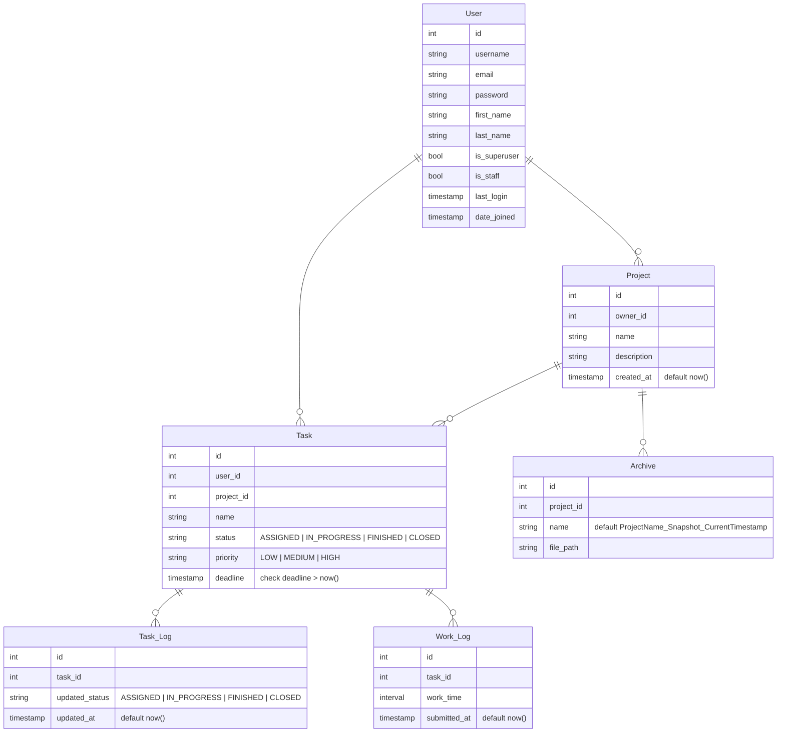

```mermaid
erDiagram
    User {
        int id
        string username
        string email
        string password
        string first_name
        string last_name
        bool is_superuser
        bool is_staff
        timestamp last_login
        timestamp date_joined
    }
    
    Project {
        int id
        int owner_id
        string name
        string description
        timestamp created_at "default now()"
    }
    
    Task {
        int id 
        int user_id
        int project_id
        string name
        string status "ASSIGNED | IN_PROGRESS | FINISHED | CLOSED"
        string priority "LOW | MEDIUM | HIGH"
        timestamp deadline "check deadline > now()"
    }
            
    Task_Log {
        int id 
        int task_id
        string updated_status "ASSIGNED | IN_PROGRESS | FINISHED | CLOSED"
        timestamp updated_at "default now()" 
    }
    
    Work_Log {
        int id 
        int task_id
        interval work_time
        timestamp submitted_at "default now()"
    }

    Archive {
        int id 
        int project_id
        string name "default ProjectName_Snapshot_CurrentTimestamp"
        string file_path
    }  
    
    User ||--o{ Project : ""
    User ||--o{ Task : ""
    Project ||--o{ Task : ""
    Project ||--o{ Archive : ""
    Task ||--o{ Task_Log : ""
    Task ||--o{ Work_Log : ""
```